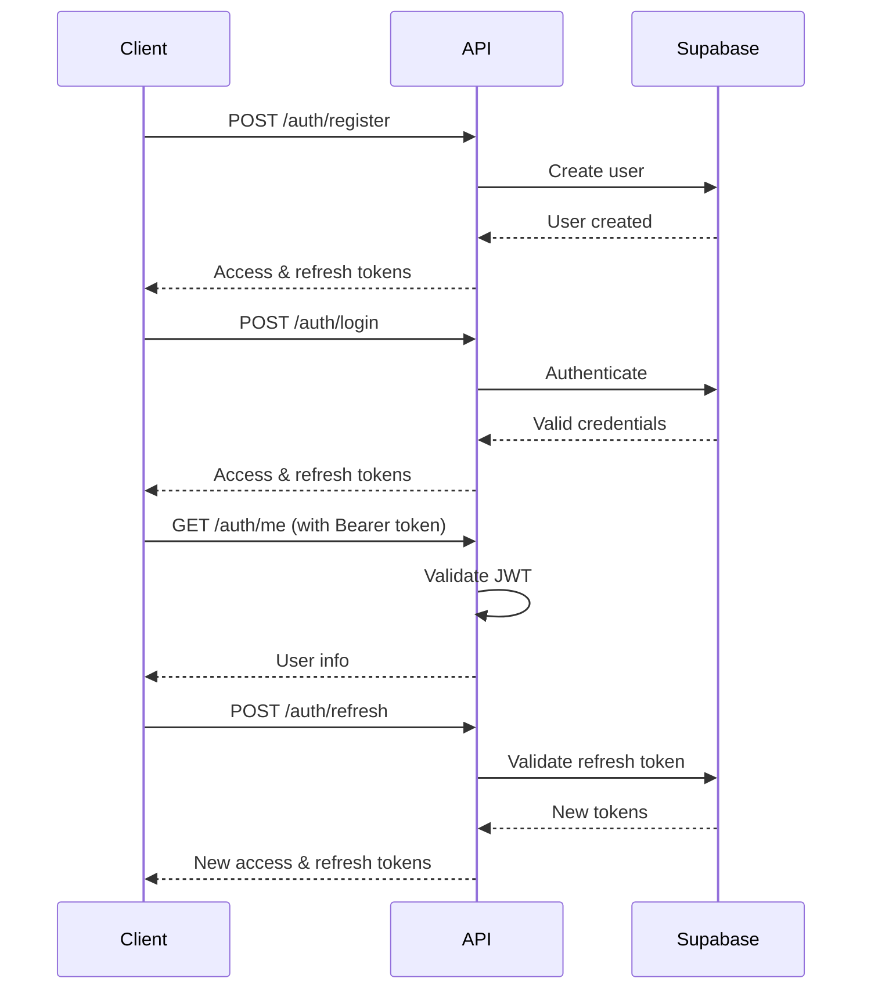

# Cookify Documentation

This directory contains comprehensive documentation for Cookify.

```bash
# Health check
curl http://dev.krija.info:8000/api/health/quick

# Detailed health check with metrics
curl http://dev.krija.info:8000/api/health/

# List ingredients
curl http://dev.krija.info:8000/api/ingredients/master

This directory contains comprehensive documentation for the Cookify meal planning application.

## 📚 Documentation Index

### API Documentation
- **[API Overview](./api-overview.md)** - Complete overview of all API endpoints and features
- **[Authentication API](./auth-api.md)** - Detailed documentation for all authentication endpoints
- **[Ingredients API](./ingredients-api.md)** - Complete documentation for ingredients master data endpoints

### OCR Documentation
- **[OCR Accuracy Guide](../backend/docs/ocr-accuracy-guide.md)** - Comprehensive guide to OCR performance, limitations, and optimization
- **[OCR Security Implementation](../backend/docs/ocr-security-implementation.md)** - Security features and best practices for OCR endpoints

### Developer Guides
- **[Logging Guide](../backend/docs/logging_guide.md)** - Best practices and standards for logging in the application

### Quick Start Guides
- [Getting Started](#getting-started)
- [Authentication Flow](#authentication-flow)
- [Common Use Cases](#common-use-cases)

## 🚀 Getting Started

### 1. Start the Backend Server

```bash
cd backend
pip install -r requirements.txt
uvicorn main:app --reload --port 8000
```

### 2. Access Interactive Documentation

- **Swagger UI:** http://dev.krija.info:8000/docs
- **ReDoc:** http://dev.krija.info:8000/redoc

### 3. Test the API

```bash
# Health check
curl http://dev.krija.info:8000/health

# List ingredients
curl http://dev.krija.info:8000/api/ingredients/master

# Register a user
curl -X POST "http://dev.krija.info:8000/api/auth/register" \
  -H "Content-Type: application/json" \
  -d '{
    "email": "test@example.com",
    "password": "SecurePassword123!",
    "username": "testuser"
  }'
```

## 🔐 Authentication Flow



## 📖 Common Use Cases

### User Registration and Login

```javascript
// Register new user
const registerResponse = await fetch('/api/auth/register', {
  method: 'POST',
  headers: { 'Content-Type': 'application/json' },
  body: JSON.stringify({
    email: 'user@example.com',
    password: 'SecurePassword123!',
    username: 'foodlover'
  })
});

const { data } = await registerResponse.json();
localStorage.setItem('access_token', data.access_token);
localStorage.setItem('refresh_token', data.refresh_token);

// Login existing user
const loginResponse = await fetch('/api/auth/login', {
  method: 'POST',
  headers: { 'Content-Type': 'application/json' },
  body: JSON.stringify({
    email: 'user@example.com',
    password: 'SecurePassword123!'
  })
});
```

### Working with Ingredients

```javascript
// Get all ingredients with pagination
const ingredientsResponse = await fetch('/api/ingredients/master?limit=20&offset=0');
const ingredients = await ingredientsResponse.json();

// Search for specific ingredients
const searchResponse = await fetch('/api/ingredients/search?q=chicken&limit=10');
const searchResults = await searchResponse.json();

// Create new ingredient (requires authentication)
const token = localStorage.getItem('access_token');
const createResponse = await fetch('/api/ingredients/master', {
  method: 'POST',
  headers: {
    'Content-Type': 'application/json',
    'Authorization': `Bearer ${token}`
  },
  body: JSON.stringify({
    name: 'Organic Chicken Breast',
    calories_per_100g: 165,
    proteins_per_100g: 31,
    fat_per_100g: 3.6,
    carbs_per_100g: 0,
    price_per_100g_cents: 899
  })
});
```

### Profile Management

```javascript
// Get current user profile
const token = localStorage.getItem('access_token');
const profileResponse = await fetch('/api/auth/me', {
  headers: { 'Authorization': `Bearer ${token}` }
});
const userProfile = await profileResponse.json();

// Update profile
const updateResponse = await fetch('/api/auth/profile', {
  method: 'PUT',
  headers: {
    'Content-Type': 'application/json',
    'Authorization': `Bearer ${token}`
  },
  body: JSON.stringify({
    display_name: 'Chef John',
    bio: 'Passionate home cook',
    preferences: {
      dietary_restrictions: ['vegetarian'],
      favorite_cuisines: ['italian', 'thai']
    }
  })
});
```

### Error Handling

```javascript
async function makeAPIRequest(url, options = {}) {
  try {
    const response = await fetch(url, options);
    
    if (response.status === 401) {
      // Token expired, try to refresh
      const refreshed = await refreshToken();
      if (refreshed) {
        // Retry with new token
        return makeAPIRequest(url, {
          ...options,
          headers: {
            ...options.headers,
            'Authorization': `Bearer ${localStorage.getItem('access_token')}`
          }
        });
      } else {
        // Redirect to login
        window.location.href = '/login';
        return;
      }
    }
    
    if (!response.ok) {
      const error = await response.json();
      throw new Error(error.detail.error || 'API request failed');
    }
    
    return await response.json();
  } catch (error) {
    console.error('API Error:', error);
    throw error;
  }
}

async function refreshToken() {
  try {
    const refreshToken = localStorage.getItem('refresh_token');
    const response = await fetch('/api/auth/refresh', {
      method: 'POST',
      headers: { 'Content-Type': 'application/json' },
      body: JSON.stringify({ refresh_token: refreshToken })
    });
    
    if (response.ok) {
      const data = await response.json();
      localStorage.setItem('access_token', data.access_token);
      localStorage.setItem('refresh_token', data.refresh_token);
      return true;
    }
  } catch (error) {
    console.error('Token refresh failed:', error);
  }
  
  return false;
}
```

## 🛠️ Development Tools

### Postman Collection

Import the Postman collection for easy API testing:

```json
{
  "info": {
    "name": "Cookify API",
    "description": "Complete API collection for Cookify"
  },
  "auth": {
    "type": "bearer",
    "bearer": [
      {
        "key": "token",
        "value": "{{access_token}}",
        "type": "string"
      }
    ]
  },
  "variable": [
    {
      "key": "base_url",
      "value": "http://dev.krija.info:8000/api"
    },
    {
      "key": "access_token",
      "value": ""
    }
  ]
}
```

### VS Code REST Client

Create a `.http` file for VS Code REST Client:

```http
### Variables
@baseUrl = http://dev.krija.info:8000/api
@accessToken = your_access_token_here

### Health Check
GET {{baseUrl}}/../health

### Register User
POST {{baseUrl}}/auth/register
Content-Type: application/json

{
  "email": "test@example.com",
  "password": "SecurePassword123!",
  "username": "testuser"
}

### Login User
POST {{baseUrl}}/auth/login
Content-Type: application/json

{
  "email": "test@example.com",
  "password": "SecurePassword123!"
}

### Get Current User
GET {{baseUrl}}/auth/me
Authorization: Bearer {{accessToken}}

### List Ingredients
GET {{baseUrl}}/ingredients/master?limit=10&offset=0

### Search Ingredients
GET {{baseUrl}}/ingredients/search?q=chicken&limit=5

### Create Ingredient
POST {{baseUrl}}/ingredients/master
Authorization: Bearer {{accessToken}}
Content-Type: application/json

{
  "name": "Test Ingredient",
  "calories_per_100g": 100.0,
  "proteins_per_100g": 10.0,
  "fat_per_100g": 5.0,
  "carbs_per_100g": 15.0,
  "price_per_100g_cents": 200
}
```

## 📋 API Checklist

When implementing new features, ensure:

- [ ] **Authentication**: Properly secure endpoints that require auth
- [ ] **Validation**: Validate all input data using Pydantic schemas
- [ ] **Error Handling**: Return meaningful error messages with proper status codes
- [ ] **Documentation**: Update API documentation and examples
- [ ] **Testing**: Write comprehensive unit and integration tests
- [ ] **Logging**: Add appropriate logging for debugging and monitoring
- [ ] **Rate Limiting**: Consider rate limiting for sensitive endpoints

## 🔍 Troubleshootingija.info:8000/api/ingredients/master

### Common Issues

1. **CORS Errors**
   - Ensure frontend origin is in CORS allowed origins
   - Check preflight requests are handled correctly

2. **Authentication Failures**
   - Verify token format: `Bearer <token>`
   - Check token expiration and refresh if needed
   - Ensure Supabase configuration is correct

3. **Database Errors**
   - Check Supabase connection settings
   - Verify database schema matches models
   - Check environment variables

4. **Rate Limiting**
   - Implement exponential backoff
   - Check rate limit headers in responses
   - Consider caching frequently accessed data

### Debug Mode

Enable debug mode for detailed error information:

```bash
ENVIRONMENT=development uvicorn main:app --reload --port 8000
```

### Logging

Check application logs for detailed error information:

```bash
tail -f backend/logs/app.log
```

## 📞 Support

Need help? Here are your options:

- 📖 **Documentation**: Check this documentation first
- 🐛 **Bug Reports**: Create an issue on GitHub
- 💡 **Feature Requests**: Submit via GitHub Discussions
- 📧 **Direct Contact**: dev@cookify.app

## 🤝 Contributing

We welcome contributions! Please see our contributing guidelines:

1. Fork the repository
2. Create a feature branch
3. Make your changes
4. Add tests and documentation
5. Submit a pull request

### Documentation Updates

To update documentation:

1. Edit the relevant `.md` files in this directory
2. Ensure examples are tested and working
3. Update the table of contents if needed
4. Submit a pull request with your changes

---

**Happy Coding! 🚀**
