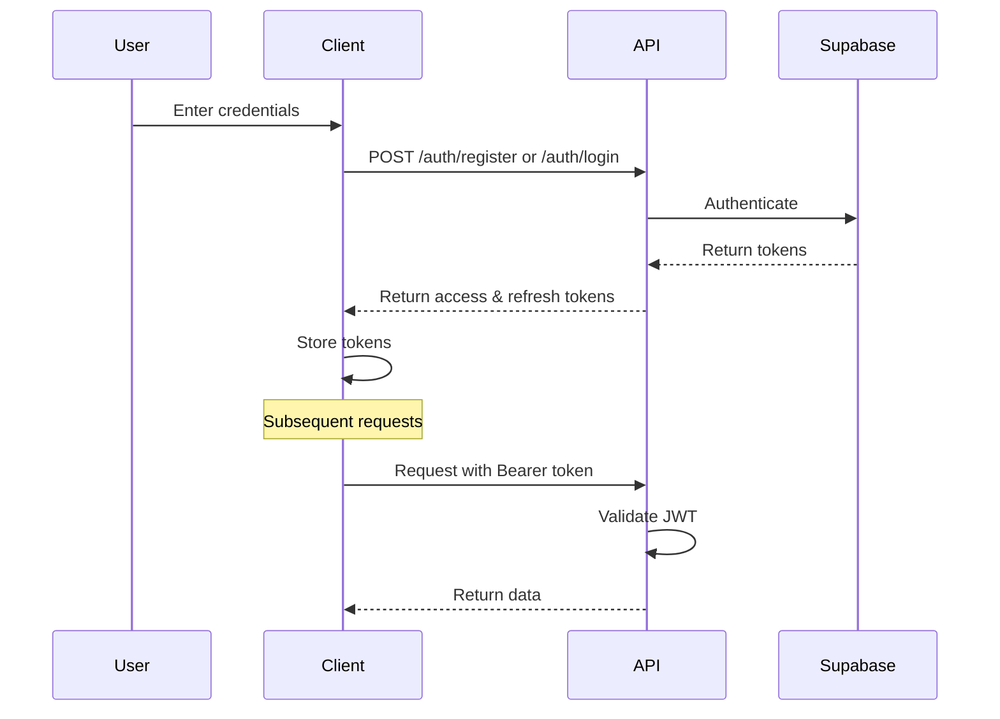

# Authentication API Documentation

This document provides comprehensive documentation for all authentication endpoints in the Cookify meal planning application.

## Overview

The Authentication API handles user registration, login, password management, email verification, and user profile operations. It uses Supabase Auth as the backend authentication provider and provides JWT-based session management.

**Base URL:** `/api/auth`

## Table of Contents

1. [Authentication Flow](#authentication-flow)
2. [Endpoints Overview](#endpoints-overview)
3. [Endpoint Documentation](#endpoint-documentation)
4. [Error Handling](#error-handling)
5. [Security Considerations](#security-considerations)
6. [Usage Examples](#usage-examples)

## Authentication Flow



## Endpoints Overview

| Method | Endpoint | Description | Auth Required |
|--------|----------|-------------|---------------|
| POST | `/auth/register` | Register new user | ❌ |
| POST | `/auth/login` | User login | ❌ |
| POST | `/auth/refresh` | Refresh access token | ❌ |
| POST | `/auth/logout` | User logout | ✅ |
| GET | `/auth/me` | Get current user info | ✅ |
| GET | `/auth/profile` | Get user profile | ✅ |
| PUT | `/auth/profile` | Update user profile | ✅ |
| POST | `/auth/forgot-password` | Request password reset | ❌ |
| POST | `/auth/reset-password` | Reset password with token | ❌ |
| POST | `/auth/verify-email` | Verify email address | ❌ |
| POST | `/auth/resend-verification` | Resend verification email | ❌ |
| POST | `/auth/change-password` | Change password (authenticated) | ✅ |
| POST | `/auth/password-strength` | Check password strength | ❌ |
| GET | `/auth/health` | Health check | ❌ |
| GET | `/auth/user` | Get optional user info | ❌ |
| POST | `/auth/dev-login` | Development login (dev only) | ❌ |

## Endpoint Documentation

### User Registration

**POST** `/auth/register`

Register a new user account with email and password.

#### Request Body

```json
{
  "email": "user@example.com",
  "password": "SecurePassword123!",
  "username": "optional_username"
}
```

#### Response

**Success (201):**
```json
{
  "success": true,
  "message": "Registration successful",
  "error": null,
  "data": {
    "access_token": "eyJhbGciOiJIUzI1NiIs...",
    "refresh_token": "eyJhbGciOiJIUzI1NiIs...",
    "expires_in": 3600,
    "token_type": "bearer",
    "user": {
      "id": "550e8400-e29b-41d4-a716-446655440000",
      "email": "user@example.com",
      "is_active": true,
      "is_verified": false,
      "created_at": "2025-06-12T10:00:00Z",
      "updated_at": "2025-06-12T10:00:00Z"
    }
  }
}
```

**Error (409 - Email exists):**
```json
{
  "detail": {
    "error": "Email already registered",
    "error_code": "EMAIL_EXISTS"
  }
}
```

#### Validation Rules

- **Email**: Must be valid email format
- **Password**: Minimum 6 characters, maximum 128 characters
- **Username**: Optional, 3-50 characters if provided

### User Login

**POST** `/auth/login`

Authenticate user with email and password.

#### Request Body

```json
{
  "email": "user@example.com",
  "password": "SecurePassword123!"
}
```

#### Response

**Success (200):**
```json
{
  "success": true,
  "message": "Login successful",
  "error": null,
  "data": {
    "access_token": "eyJhbGciOiJIUzI1NiIs...",
    "refresh_token": "eyJhbGciOiJIUzI1NiIs...",
    "expires_in": 3600,
    "token_type": "bearer",
    "user": {
      "id": "550e8400-e29b-41d4-a716-446655440000",
      "email": "user@example.com",
      "is_active": true,
      "is_verified": true,
      "created_at": "2025-06-12T10:00:00Z",
      "updated_at": "2025-06-12T10:00:00Z"
    }
  }
}
```

**Error (401 - Invalid credentials):**
```json
{
  "detail": {
    "error": "Invalid email or password",
    "error_code": "INVALID_CREDENTIALS"
  }
}
```

### Token Refresh

**POST** `/auth/refresh`

Refresh access token using a valid refresh token.

#### Request Body

```json
{
  "refresh_token": "eyJhbGciOiJIUzI1NiIs..."
}
```

#### Response

**Success (200):**
```json
{
  "access_token": "eyJhbGciOiJIUzI1NiIs...",
  "refresh_token": "eyJhbGciOiJIUzI1NiIs...",
  "expires_in": 3600,
  "token_type": "bearer",
  "user": {
    "id": "550e8400-e29b-41d4-a716-446655440000",
    "email": "user@example.com",
    "is_active": true,
    "is_verified": true,
    "created_at": "2025-06-12T10:00:00Z",
    "updated_at": "2025-06-12T10:00:00Z"
  }
}
```

### User Logout

**POST** `/auth/logout`

Logout user and invalidate the current session.

#### Headers

```
Authorization: Bearer <access_token>
```

#### Response

**Success (200):**
```json
{
  "message": "Logged out successfully",
  "success": true
}
```

### Get Current User

**GET** `/auth/me`

Get current authenticated user information including profile data.

#### Headers

```
Authorization: Bearer <access_token>
```

#### Response

**Success (200):**
```json
{
  "user": {
    "id": "550e8400-e29b-41d4-a716-446655440000",
    "email": "user@example.com",
    "is_active": true,
    "is_verified": true,
    "created_at": "2025-06-12T10:00:00Z",
    "updated_at": "2025-06-12T10:00:00Z"
  },
  "profile": {
    "id": "550e8400-e29b-41d4-a716-446655440000",
    "user_id": "550e8400-e29b-41d4-a716-446655440000",
    "display_name": "John Doe",
    "first_name": "John",
    "last_name": "Doe",
    "avatar_url": "https://example.com/avatar.jpg",
    "bio": "Food enthusiast",
    "timezone": "UTC",
    "language": "en",
    "preferences": {},
    "created_at": "2025-06-12T10:00:00Z",
    "updated_at": "2025-06-12T10:00:00Z"
  }
}
```

### Get User Profile

**GET** `/auth/profile`

Get current user's detailed profile information.

#### Headers

```
Authorization: Bearer <access_token>
```

#### Response

**Success (200):**
```json
{
  "id": "550e8400-e29b-41d4-a716-446655440000",
  "user_id": "550e8400-e29b-41d4-a716-446655440000",
  "display_name": "John Doe",
  "first_name": "John",
  "last_name": "Doe",
  "avatar_url": "https://example.com/avatar.jpg",
  "bio": "Food enthusiast and home cook",
  "timezone": "America/New_York",
  "language": "en",
  "preferences": {
    "dietary_restrictions": ["vegetarian"],
    "favorite_cuisines": ["italian", "mexican"]
  },
  "created_at": "2025-06-12T10:00:00Z",
  "updated_at": "2025-06-12T10:00:00Z"
}
```

### Update User Profile

**PUT** `/auth/profile`

Update current user's profile information.

#### Headers

```
Authorization: Bearer <access_token>
```

#### Request Body

```json
{
  "display_name": "John Smith",
  "first_name": "John",
  "last_name": "Smith",
  "avatar_url": "https://example.com/new-avatar.jpg",
  "bio": "Passionate home chef and recipe creator",
  "timezone": "Europe/London",
  "language": "en",
  "preferences": {
    "dietary_restrictions": ["gluten-free"],
    "favorite_cuisines": ["asian", "mediterranean"],
    "notifications": {
      "email": true,
      "push": false
    }
  }
}
```

#### Response

**Success (200):**
```json
{
  "success": true,
  "message": "Profile updated successfully",
  "error": null,
  "data": {
    "id": "550e8400-e29b-41d4-a716-446655440000",
    "user_id": "550e8400-e29b-41d4-a716-446655440000",
    "display_name": "John Smith",
    "first_name": "John",
    "last_name": "Smith",
    "avatar_url": "https://example.com/new-avatar.jpg",
    "bio": "Passionate home chef and recipe creator",
    "timezone": "Europe/London",
    "language": "en",
    "preferences": {
      "dietary_restrictions": ["gluten-free"],
      "favorite_cuisines": ["asian", "mediterranean"],
      "notifications": {
        "email": true,
        "push": false
      }
    },
    "created_at": "2025-06-12T10:00:00Z",
    "updated_at": "2025-06-12T16:30:00Z"
  }
}
```

### Password Reset Request

**POST** `/auth/forgot-password`

Request a password reset email.

#### Request Body

```json
{
  "email": "user@example.com"
}
```

#### Response

**Success (200):**
```json
{
  "message": "Password reset email sent",
  "success": true
}
```

### Password Reset Confirmation

**POST** `/auth/reset-password`

Reset password using a reset token from email.

#### Request Body

```json
{
  "token": "reset_token_from_email",
  "new_password": "NewSecurePassword123!"
}
```

#### Response

**Success (200):**
```json
{
  "message": "Password reset successfully",
  "success": true
}
```

### Email Verification

**POST** `/auth/verify-email`

Verify email address using verification token.

#### Request Body

```json
{
  "token": "verification_token_from_email"
}
```

#### Response

**Success (200):**
```json
{
  "message": "Email verified successfully",
  "success": true
}
```

### Resend Verification Email

**POST** `/auth/resend-verification`

Resend email verification.

#### Request Body

```json
{
  "email": "user@example.com"
}
```

#### Response

**Success (200):**
```json
{
  "message": "Verification email sent",
  "success": true
}
```

### Change Password (Authenticated)

**POST** `/auth/change-password`

Change password for authenticated user.

#### Headers

```
Authorization: Bearer <access_token>
```

#### Request Body

```json
{
  "old_password": "CurrentPassword123!",
  "new_password": "NewSecurePassword123!"
}
```

#### Response

**Success (200):**
```json
{
  "message": "Password changed successfully",
  "success": true
}
```

### Password Strength Check

**POST** `/auth/password-strength`

Check password strength and get requirements.

#### Request Body

```json
{
  "password": "TestPassword123!"
}
```

#### Response

**Success (200):**
```json
{
  "is_strong": true,
  "score": 4,
  "requirements": [
    {
      "requirement": "At least 8 characters",
      "met": true
    },
    {
      "requirement": "Contains uppercase letter",
      "met": true
    },
    {
      "requirement": "Contains lowercase letter",
      "met": true
    },
    {
      "requirement": "Contains number",
      "met": true
    },
    {
      "requirement": "Contains special character",
      "met": true
    }
  ],
  "suggestions": []
}
```

### Health Check

**GET** `/auth/health`

Check authentication service health.

#### Response

**Success (200):**
```json
{
  "message": "Authentication service is healthy",
  "success": true
}
```

### Get Optional User Info

**GET** `/auth/user`

Get user information without requiring authentication (returns null if not authenticated).

#### Headers (Optional)

```
Authorization: Bearer <access_token>
```

#### Response

**Success (200) - Authenticated:**
```json
{
  "user": {
    "id": "550e8400-e29b-41d4-a716-446655440000",
    "email": "user@example.com",
    "is_active": true,
    "is_verified": true
  },
  "profile": {
    "display_name": "John Doe",
    "avatar_url": "https://example.com/avatar.jpg"
  }
}
```

**Success (200) - Not Authenticated:**
```json
{
  "user": null,
  "profile": null
}
```

### Development Login

**POST** `/auth/dev-login`

Development-only login endpoint (only available in development mode).

#### Response

**Success (200):**
```json
{
  "success": true,
  "message": "Development login successful",
  "error": null,
  "data": {
    "access_token": "eyJhbGciOiJIUzI1NiIs...",
    "refresh_token": "eyJhbGciOiJIUzI1NiIs...",
    "expires_in": 3600,
    "token_type": "bearer",
    "user": {
      "id": "550e8400-e29b-41d4-a716-446655440000",
      "email": "dev@cookify.local",
      "is_active": true,
      "is_verified": true,
      "created_at": "2025-06-12T10:00:00Z",
      "updated_at": "2025-06-12T10:00:00Z"
    }
  }
}
```

## Error Handling

All endpoints return structured error responses with appropriate HTTP status codes.

### Error Response Format

```json
{
  "detail": {
    "error": "Human-readable error message",
    "error_code": "MACHINE_READABLE_ERROR_CODE"
  }
}
```

### Common Error Codes

| Error Code | Description | HTTP Status |
|------------|-------------|-------------|
| `EMAIL_EXISTS` | Email already registered | 409 |
| `INVALID_CREDENTIALS` | Invalid email or password | 401 |
| `USER_NOT_FOUND` | User account not found | 404 |
| `TOKEN_EXPIRED` | Access token has expired | 401 |
| `TOKEN_INVALID` | Invalid or malformed token | 401 |
| `EMAIL_NOT_VERIFIED` | Email address not verified | 403 |
| `WEAK_PASSWORD` | Password doesn't meet requirements | 400 |
| `RATE_LIMIT_EXCEEDED` | Too many requests | 429 |
| `INTERNAL_ERROR` | Server error | 500 |
| `VALIDATION_ERROR` | Request validation failed | 422 |

### HTTP Status Codes

- **200 OK**: Successful operation
- **201 Created**: User successfully registered
- **400 Bad Request**: Invalid request data
- **401 Unauthorized**: Authentication required or failed
- **403 Forbidden**: Access denied (e.g., unverified email)
- **404 Not Found**: Resource not found
- **409 Conflict**: Resource already exists
- **422 Unprocessable Entity**: Validation error
- **429 Too Many Requests**: Rate limit exceeded
- **500 Internal Server Error**: Server error

## Security Considerations

### Token Management

- **Access Tokens**: Short-lived (1 hour), used for API requests
- **Refresh Tokens**: Long-lived (30 days), used to obtain new access tokens
- **Secure Storage**: Store tokens securely on client side
- **Token Rotation**: Refresh tokens are rotated on each use

### Password Requirements

- Minimum 8 characters
- Must contain uppercase and lowercase letters
- Must contain at least one number
- Must contain at least one special character
- Maximum 128 characters

### Rate Limiting

Authentication endpoints are rate-limited to prevent abuse:

- Login: 5 attempts per 15 minutes per IP
- Registration: 3 attempts per hour per IP
- Password reset: 3 attempts per hour per email

### CORS Configuration

The API supports CORS for the following origins:
- `http://localhost:3000` (Web app)
- `http://dev.krija.info:8000` (Development)
- `http://localhost:19000` (Mobile development)
- `http://localhost:19006` (Mobile development)

## Usage Examples

### JavaScript/TypeScript

#### Registration
```typescript
const response = await fetch('/api/auth/register', {
  method: 'POST',
  headers: {
    'Content-Type': 'application/json',
  },
  body: JSON.stringify({
    email: 'user@example.com',
    password: 'SecurePassword123!',
    username: 'johndoe'
  })
});

const data = await response.json();
if (data.success) {
  localStorage.setItem('access_token', data.data.access_token);
  localStorage.setItem('refresh_token', data.data.refresh_token);
}
```

#### Login
```typescript
const response = await fetch('/api/auth/login', {
  method: 'POST',
  headers: {
    'Content-Type': 'application/json',
  },
  body: JSON.stringify({
    email: 'user@example.com',
    password: 'SecurePassword123!'
  })
});

const data = await response.json();
if (data.success) {
  localStorage.setItem('access_token', data.data.access_token);
  localStorage.setItem('refresh_token', data.data.refresh_token);
}
```

#### Authenticated Request
```typescript
const token = localStorage.getItem('access_token');
const response = await fetch('/api/auth/me', {
  headers: {
    'Authorization': `Bearer ${token}`
  }
});

const userData = await response.json();
```

#### Token Refresh
```typescript
const refreshToken = localStorage.getItem('refresh_token');
const response = await fetch('/api/auth/refresh', {
  method: 'POST',
  headers: {
    'Content-Type': 'application/json',
  },
  body: JSON.stringify({
    refresh_token: refreshToken
  })
});

const data = await response.json();
if (response.ok) {
  localStorage.setItem('access_token', data.access_token);
  localStorage.setItem('refresh_token', data.refresh_token);
}
```

### Python

#### Registration
```python
import requests

response = requests.post('http://dev.krija.info:8000/api/auth/register', json={
    'email': 'user@example.com',
    'password': 'SecurePassword123!',
    'username': 'johndoe'
})

data = response.json()
if data['success']:
    access_token = data['data']['access_token']
    refresh_token = data['data']['refresh_token']
```

#### Authenticated Request
```python
headers = {'Authorization': f'Bearer {access_token}'}
response = requests.get('http://dev.krija.info:8000/api/auth/me', headers=headers)
user_data = response.json()
```

### cURL

#### Login
```bash
curl -X POST "http://dev.krija.info:8000/api/auth/login" \
  -H "Content-Type: application/json" \
  -d '{
    "email": "user@example.com",
    "password": "SecurePassword123!"
  }'
```

#### Get Current User
```bash
curl -X GET "http://dev.krija.info:8000/api/auth/me" \
  -H "Authorization: Bearer YOUR_ACCESS_TOKEN"
```

#### Update Profile
```bash
curl -X PUT "http://dev.krija.info:8000/api/auth/profile" \
  -H "Authorization: Bearer YOUR_ACCESS_TOKEN" \
  -H "Content-Type: application/json" \
  -d '{
    "display_name": "John Smith",
    "bio": "Food enthusiast"
  }'
```

## Integration with Frontend

### Authentication Context

```typescript
interface AuthContext {
  user: User | null;
  login: (email: string, password: string) => Promise<boolean>;
  register: (email: string, password: string, username?: string) => Promise<boolean>;
  logout: () => Promise<void>;
  refreshToken: () => Promise<boolean>;
  isAuthenticated: boolean;
  isLoading: boolean;
}
```

### Error Handling

```typescript
async function handleApiRequest(request: () => Promise<Response>) {
  try {
    const response = await request();
    
    if (response.status === 401) {
      // Try to refresh token
      const refreshed = await refreshToken();
      if (refreshed) {
        // Retry the original request
        return await request();
      } else {
        // Redirect to login
        window.location.href = '/login';
        return;
      }
    }
    
    if (!response.ok) {
      const error = await response.json();
      throw new Error(error.detail.error);
    }
    
    return await response.json();
  } catch (error) {
    console.error('API request failed:', error);
    throw error;
  }
}
```

## Troubleshooting

### Common Issues

1. **401 Unauthorized**
   - Check if access token is included in Authorization header
   - Verify token format: `Bearer <token>`
   - Try refreshing the token

2. **Token Expired**
   - Use refresh token to get new access token
   - Implement automatic token refresh in your client

3. **Email Not Verified**
   - Check email for verification link
   - Use `/auth/resend-verification` to resend email

4. **Rate Limiting**
   - Wait before retrying
   - Implement exponential backoff
   - Check if you're making too many requests

5. **CORS Issues**
   - Ensure your domain is in the allowed origins list
   - Check if preflight requests are being handled

### Development Tools

- Use browser developer tools to inspect network requests
- Check the `/auth/health` endpoint to verify service status
- Monitor server logs for detailed error information
- Use the `/auth/dev-login` endpoint for testing (development only)

---

For more information or support, please refer to the main project documentation or contact the development team.
